# 🏗️ Rental Vault - 25-Day Development Roadmap
## Complete Architectural Guide & Project Blueprint

---

## 📑 Table of Contents

1. [Executive Summary](#executive-summary)
2. [Technology Stack & Languages](#technology-stack--languages)
3. [Project Architecture](#project-architecture)
4. [25-Day Timeline Overview](#25-day-timeline-overview)
5. [Week 1: Foundation & Smart Contracts](#week-1-foundation--smart-contracts-days-1-7)
6. [Week 2: Backend Development](#week-2-backend-development-days-8-14)
7. [Week 3: Frontend Development](#week-3-frontend-development-days-15-21)
8. [Week 4: Integration & Deployment](#week-4-integration--deployment-days-22-25)
9. [Complete File Structure](#complete-file-structure)
10. [Testing Strategy](#testing-strategy)
11. [Deployment Architecture](#deployment-architecture)
12. [Performance & Scalability](#performance--scalability)

---

## 🎯 Executive Summary

**Rental Vault** is a decentralized application (dApp) that revolutionizes rental deposit management through blockchain technology. This 25-day roadmap provides a structured approach to building a production-ready prototype on the Stellar blockchain.

### Project Goals
- ✅ Secure escrow system using Stellar smart contracts
- ✅ Automated deposit release mechanism
- ✅ Transparent dispute resolution framework
- ✅ User-friendly interface for tenants and landlords
- ✅ Real-time blockchain transaction tracking

### Key Deliverables
- Soroban smart contract (Rust)
- RESTful API backend (Node.js/Express)
- React-based frontend
- Complete documentation
- Deployed prototype on testnet

---

## 💻 Technology Stack & Languages

### Programming Languages

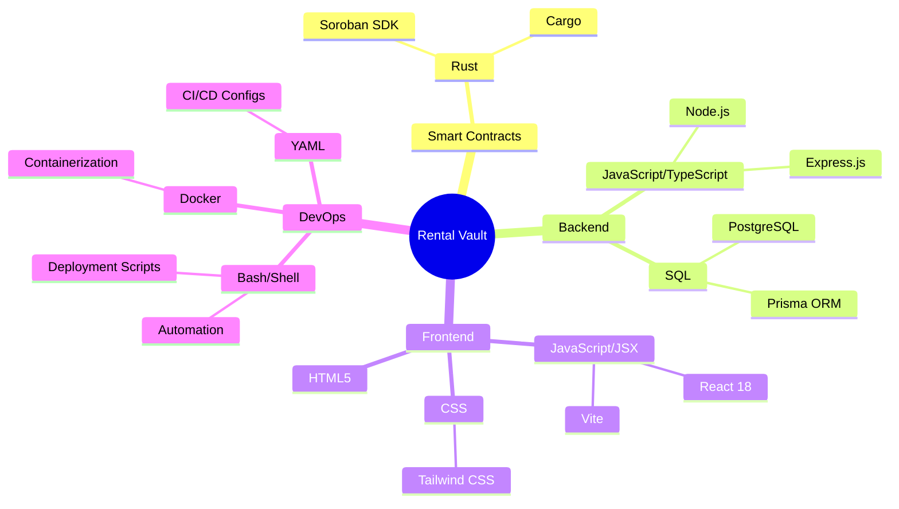

### Detailed Stack Breakdown

| Category | Technology | Language | Purpose |
|----------|-----------|----------|---------|
| **Smart Contract** | Soroban | Rust | Escrow logic, state management |
| **Contract Build** | Stellar CLI | Bash/Shell | Deploy & interact with contracts |
| **Backend API** | Express.js | JavaScript/Node.js | RESTful endpoints, business logic |
| **Database** | PostgreSQL | SQL | Persistent data storage |
| **ORM** | Prisma | TypeScript | Database schema & migrations |
| **Frontend** | React + Vite | JavaScript/JSX | User interface |
| **Styling** | Tailwind CSS | CSS | Responsive design |
| **Wallet Integration** | Freighter API | JavaScript | Blockchain interaction |
| **Testing** | Jest, Cargo Test | JavaScript, Rust | Unit & integration tests |
| **Documentation** | Markdown | Markdown | Technical documentation |
| **Deployment** | Docker, Vercel, Railway | YAML, Dockerfile | Production hosting |

### Development Tools

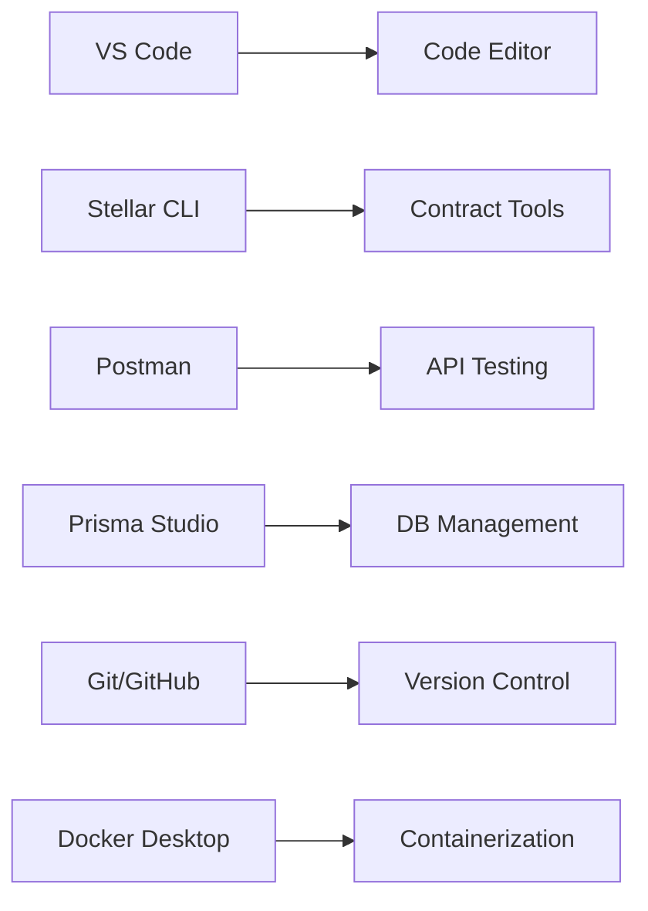

---

## 🏛️ Project Architecture

### System Architecture Overview

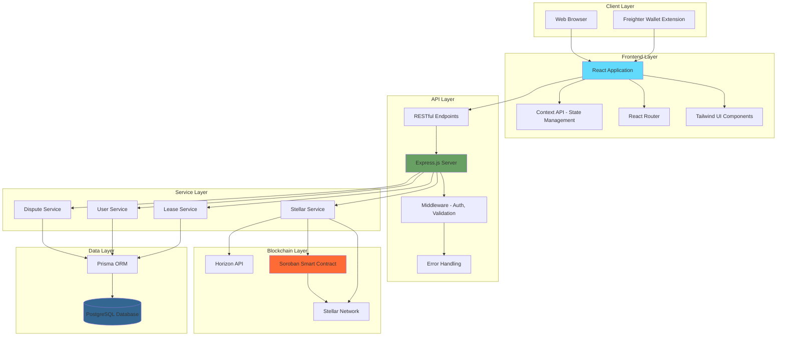

### Data Flow Architecture

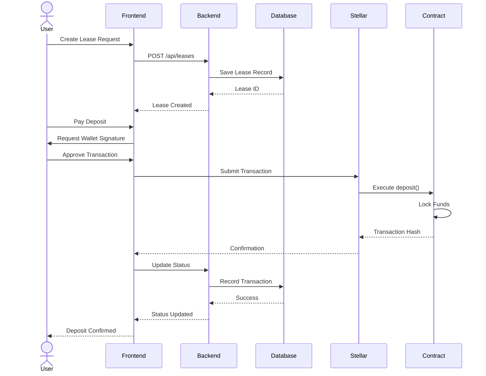

### Smart Contract State Machine

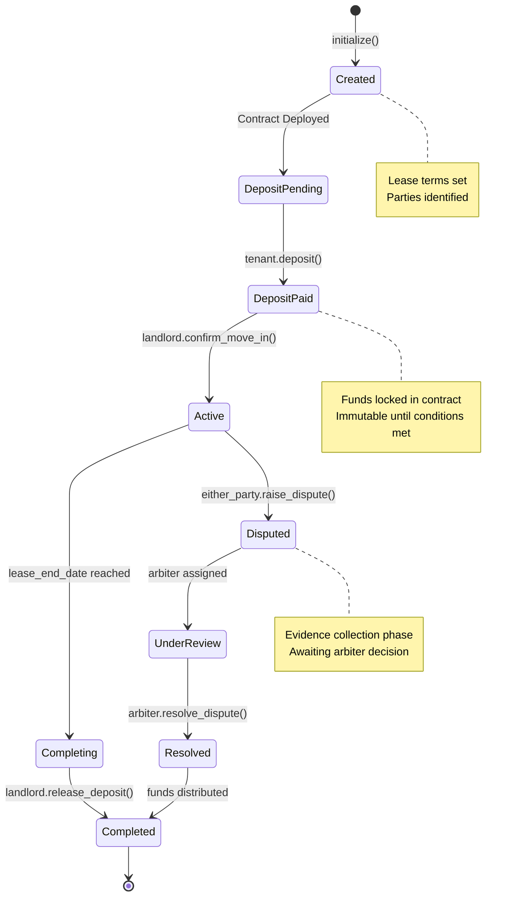

---

## 📅 25-Day Timeline Overview

### Gantt Chart

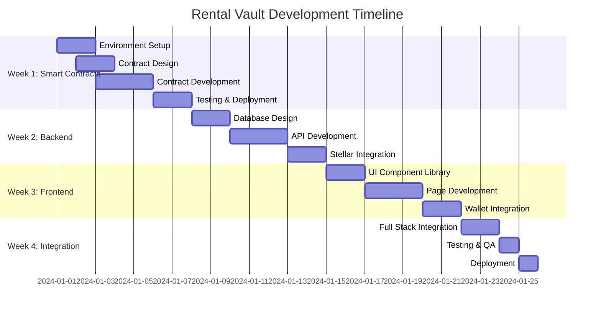

### Weekly Milestones

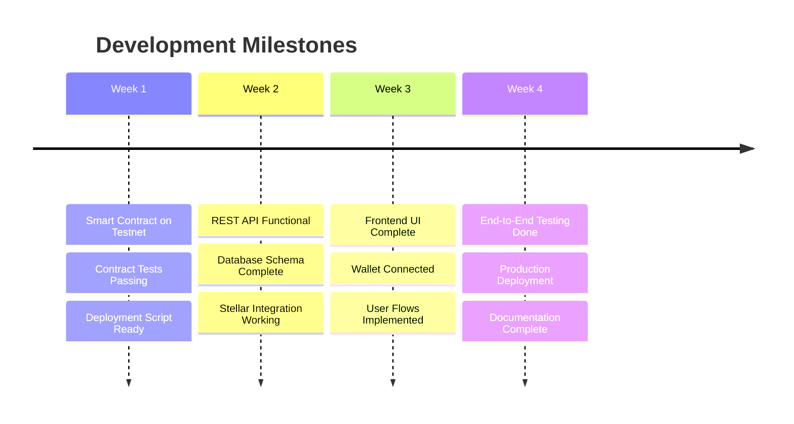

---

## 🚀 Week 1: Foundation & Smart Contracts (Days 1-7)

### Overview
Establish development environment and build the core smart contract logic using Rust and Soroban SDK.

### Weekly Goals
- ✅ Complete development environment setup
- ✅ Design and implement smart contract
- ✅ Write comprehensive tests
- ✅ Deploy to Stellar testnet
- ✅ Document contract functions

### Day-by-Day Breakdown

#### **Days 1-2: Environment Setup & Planning**

**Tasks:**
1. Install development tools
2. Configure Stellar CLI
3. Set up project structure
4. Create testnet accounts
5. Design contract architecture

**Development Environment Setup:**

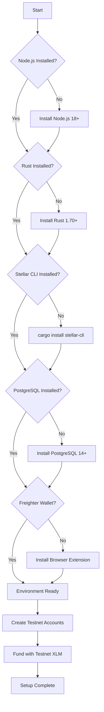

**Directory Structure Creation:**

```
rental-vault/
├── contracts/
│   └── lease-vault/
│       ├── src/
│       │   ├── lib.rs
│       │   ├── types.rs
│       │   ├── storage.rs
│       │   └── test.rs
│       ├── Cargo.toml
│       └── README.md
├── backend/
│   └── (to be created in Week 2)
├── frontend/
│   └── (to be created in Week 3)
├── scripts/
│   ├── setup-env.sh
│   ├── deploy-contract.sh
│   └── test-contract.sh
├── docs/
│   ├── architecture.md
│   ├── api-spec.md
│   └── user-guide.md
├── .gitignore
├── Cargo.toml
└── README.md
```

**Deliverables:**
- [ ] All tools installed and verified
- [ ] Testnet accounts created and funded
- [ ] Project structure initialized
- [ ] Git repository configured

---

#### **Days 3-5: Smart Contract Development**

**Contract Architecture:**

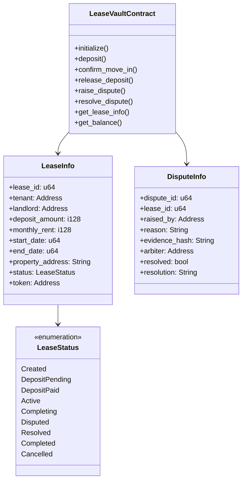

**Contract Functions Flow:**

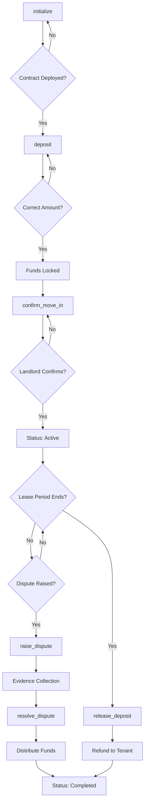

**File Structure - Smart Contract:**

```
contracts/lease-vault/
├── src/
│   ├── lib.rs              # Main contract entry point
│   │   ├── Contract struct definition
│   │   ├── Public function implementations
│   │   └── Business logic
│   │
│   ├── types.rs            # Type definitions
│   │   ├── LeaseInfo struct
│   │   ├── DisputeInfo struct
│   │   ├── LeaseStatus enum
│   │   └── DataKey enum
│   │
│   ├── storage.rs          # Storage helpers
│   │   ├── Storage key management
│   │   ├── Data serialization
│   │   └── Retrieval functions
│   │
│   ├── validation.rs       # Input validation
│   │   ├── Address validation
│   │   ├── Amount validation
│   │   └── Date validation
│   │
│   └── test.rs             # Comprehensive tests
│       ├── Unit tests
│       ├── Integration tests
│       └── Edge case tests
│
├── Cargo.toml              # Dependencies
│   ├── soroban-sdk = "21.0.0"
│   ├── Profile configurations
│   └── Optimization settings
│
└── README.md               # Contract documentation
    ├── Function descriptions
    ├── Usage examples
    └── Deployment instructions
```

**Key Contract Functions:**

1. **initialize()**
   - Purpose: Create new lease agreement
   - Inputs: Tenant, landlord, amounts, dates, property
   - Outputs: Lease ID
   - State Change: Created → DepositPending

2. **deposit()**
   - Purpose: Lock security deposit
   - Inputs: From address, amount
   - Outputs: Transaction success
   - State Change: DepositPending → DepositPaid

3. **confirm_move_in()**
   - Purpose: Landlord verification
   - Inputs: Landlord address
   - Outputs: Confirmation status
   - State Change: DepositPaid → Active

4. **release_deposit()**
   - Purpose: Return funds to tenant
   - Inputs: Initiator address
   - Outputs: Transaction hash
   - State Change: Active/Completing → Completed

5. **raise_dispute()**
   - Purpose: Initiate dispute process
   - Inputs: Reason, evidence, arbiter
   - Outputs: Dispute ID
   - State Change: Active → Disputed

6. **resolve_dispute()**
   - Purpose: Arbiter decision
   - Inputs: Resolution, fund distribution
   - Outputs: Settlement details
   - State Change: Disputed → Resolved

**Deliverables:**
- [ ] Complete contract implementation
- [ ] All functions tested
- [ ] Documentation written
- [ ] Code optimized for size

---

#### **Days 6-7: Testing & Deployment**

**Testing Strategy:**

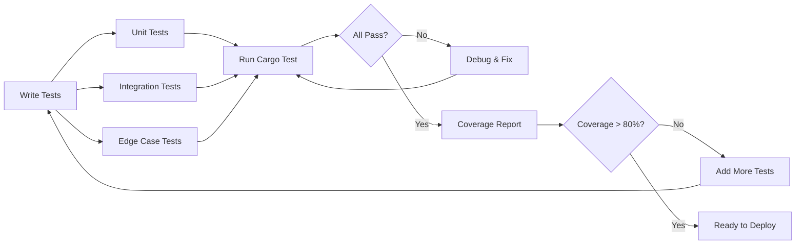

**Test Coverage Matrix:**

| Function | Unit Test | Integration Test | Edge Cases |
|----------|-----------|------------------|------------|
| initialize() | ✓ Valid inputs | ✓ Full flow | ✓ Invalid addresses |
| deposit() | ✓ Correct amount | ✓ Token transfer | ✓ Wrong amount |
| confirm_move_in() | ✓ Auth check | ✓ Status update | ✓ Wrong caller |
| release_deposit() | ✓ Balance check | ✓ Fund transfer | ✓ Before end date |
| raise_dispute() | ✓ Reason validation | ✓ Status change | ✓ Invalid status |
| resolve_dispute() | ✓ Arbiter auth | ✓ Fund split | ✓ Wrong arbiter |

**Deployment Workflow:**

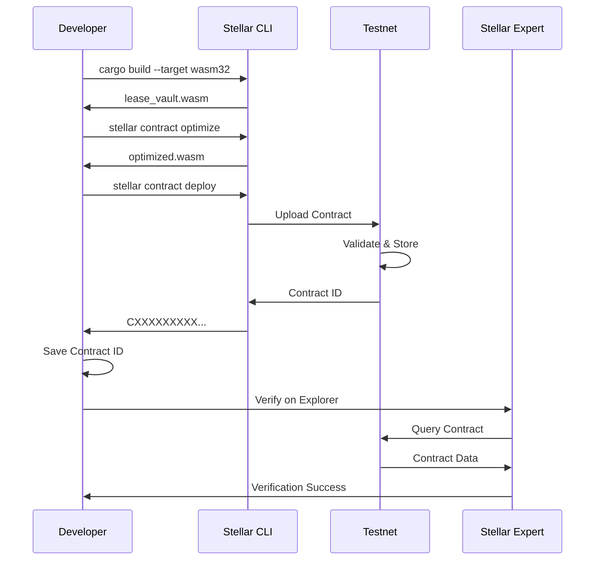

**Deployment Checklist:**

- [ ] Contract builds without errors
- [ ] All tests passing (100%)
- [ ] Contract optimized for size (<100KB)
- [ ] Testnet account funded
- [ ] Contract deployed successfully
- [ ] Contract ID saved in .env
- [ ] Verified on Stellar Expert
- [ ] Test transactions executed

**Week 1 Deliverables:**
✅ Smart contract fully functional on testnet  
✅ Comprehensive test suite (>80% coverage)  
✅ Deployment scripts automated  
✅ Contract documentation complete  
✅ Contract ID available for integration  

---

## 🔧 Week 2: Backend Development (Days 8-14)

### Overview
Build RESTful API server with PostgreSQL database and Stellar blockchain integration.

### Weekly Goals
- ✅ Design database schema
- ✅ Implement REST API endpoints
- ✅ Integrate with Stellar network
- ✅ Add authentication & validation
- ✅ Write API tests

### Database Architecture

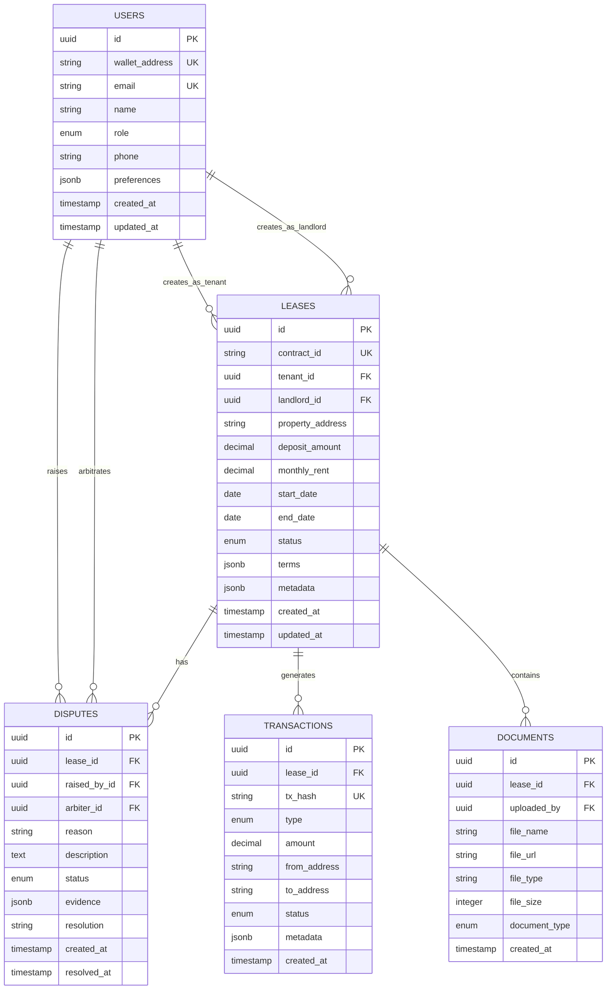

---

#### **Days 8-9: Database Design & API Setup**

**Backend Architecture:**

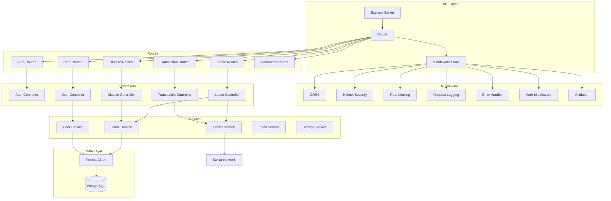

**Directory Structure - Backend:**

```
backend/
├── src/
│   ├── config/
│   │   ├── database.js         # DB connection config
│   │   ├── stellar.js          # Stellar SDK config
│   │   ├── email.js            # Email service config
│   │   └── storage.js          # File storage config
│   │
│   ├── controllers/
│   │   ├── auth.controller.js      # Authentication logic
│   │   ├── lease.controller.js     # Lease CRUD operations
│   │   ├── dispute.controller.js   # Dispute management
│   │   ├── transaction.controller.js # Transaction tracking
│   │   ├── user.controller.js      # User management
│   │   └── document.controller.js  # Document handling
│   │
│   ├── middleware/
│   │   ├── auth.middleware.js      # JWT verification
│   │   ├── validation.middleware.js # Request validation
│   │   ├── error.middleware.js     # Error handling
│   │   ├── ratelimit.middleware.js # Rate limiting
│   │   └── upload.middleware.js    # File upload handling
│   │
│   ├── routes/
│   │   ├── auth.routes.js
│   │   ├── lease.routes.js
│   │   ├── dispute.routes.js
│   │   ├── transaction.routes.js
│   │   ├── user.routes.js
│   │   └── document.routes.js
│   │
│   ├── services/
│   │   ├── stellar.service.js      # Blockchain interaction
│   │   ├── lease.service.js        # Business logic
│   │   ├── user.service.js         # User operations
│   │   ├── email.service.js        # Email notifications
│   │   └── storage.service.js      # File storage (S3/local)
│   │
│   ├── utils/
│   │   ├── logger.js               # Winston logger
│   │   ├── validators.js           # Joi schemas
│   │   ├── helpers.js              # Utility functions
│   │   ├── constants.js            # App constants
│   │   └── errors.js               # Custom error classes
│   │
│   └── server.js                   # Express app entry
│
├── prisma/
│   ├── schema.prisma               # Database schema
│   ├── migrations/                 # Migration files
│   └── seed.js                     # Seed data script
│
├── tests/
│   ├── unit/
│   │   ├── controllers/
│   │   ├── services/
│   │   └── utils/
│   ├── integration/
│   │   ├── api/
│   │   └── stellar/
│   └── setup.js
│
├── .env.example
├── .env.development
├── .env.test
├── .env.production
├── package.json
├── jest.config.js
├── Dockerfile
└── README.md
```

**API Endpoint Structure:**

```mermaid
graph LR
    A[API Root /api] --> B[/auth]
    A --> C[/leases]
    A --> D[/disputes]
    A --> E[/transactions]
    A --> F[/users]
    A --> G[/documents]
    
    B --> B1[POST /register]
    B --> B2[POST /login]
    B --> B3[POST /refresh]
    B --> B4[POST /logout]
    
    C --> C1[GET /leases]
    C --> C2[POST /leases]
    C --> C3[GET /leases/:id]
    C --> C4[PATCH /leases/:id]
    C --> C5[DELETE /leases/:id]
    C --> C6[POST /leases/:id/initialize]
    C --> C7[POST /leases/:id/deposit]
    C --> C8[POST /leases/:id/confirm]
    C --> C9[POST /leases/:id/release]
    
    D --> D1[GET /disputes]
    D --> D2[POST /disputes]
    D --> D3[GET /disputes/:id]
    D --> D4[PATCH /disputes/:id/resolve]
    
    E --> E1[GET /transactions]
    E --> E2[GET /transactions/:id]
    E --> E3[GET /transactions/lease/:leaseId]
    
    F --> F1[GET /users/profile]
    F --> F2[PATCH /users/profile]
    F --> F3[GET /users/:id]
    
    G --> G1[POST /documents/upload]
    G --> G2[GET /documents/:id]
    G --> G3[DELETE /documents/:id]
```

**Deliverables:**
- [ ] Database schema designed and documented
- [ ] Prisma schema created
- [ ] Initial migrations generated
- [ ] Express server configured
- [ ] Middleware stack implemented
- [ ] Route structure defined

---

#### **Days 10-12: API Implementation**

**Request/Response Flow:**

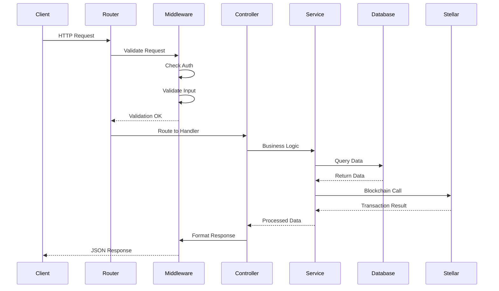

**API Endpoints Detail:**

**1. Lease Management Endpoints**

```
POST /api/leases
- Create new lease
- Body: { propertyAddress, tenantWallet, landlordWallet, depositAmount, monthlyRent, startDate, endDate }
- Response: { success, data: { lease } }
- Auth: Required
- Validation: Address format, positive amounts, valid dates

GET /api/leases
- List all leases (with filters)
- Query: { status, tenantId, landlordId, page, limit }
- Response: { success, data: [leases], pagination }
- Auth: Required

GET /api/leases/:id
- Get lease details
- Response: { success, data: { lease, transactions, disputes } }
- Auth: Required
- Access Control: Only parties involved

POST /api/leases/:id/initialize
- Initialize lease on blockchain
- Body: { tenantSecretKey }
- Response: { success, data: { contractId, txHash } }
- Auth: Required (tenant only)
- Side Effects: Contract deployment, DB update

POST /api/leases/:id/deposit
- Submit deposit transaction
- Body: { txHash }
- Response: { success, data: { transaction } }
- Auth: Required (tenant only)
- Validation: Transaction verification

POST /api/leases/:id/confirm
- Confirm tenant move-in
- Response: { success, data: { lease } }
- Auth: Required (landlord only)
- Side Effects: Blockchain call, status update

POST /api/leases/:id/release
- Release deposit to tenant
- Response: { success, data: { transaction } }
- Auth: Required (landlord only)
- Validation: Lease ended, no active disputes
```

**2. Dispute Management Endpoints**

```
POST /api/disputes
- Raise new dispute
- Body: { leaseId, reason, description, evidenceUrls, arbiterId }
- Response: { success, data: { dispute } }
- Auth: Required (tenant or landlord)

GET /api/disputes/:id
- Get dispute details
- Response: { success, data: { dispute, evidence, timeline } }
- Auth: Required

PATCH /api/disputes/:id/resolve
- Resolve dispute (arbiter only)
- Body: { resolution, tenantAmount, landlordAmount }
- Response: { success, data: { dispute, transactions } }
- Auth: Required (arbiter only)
- Side Effects: Blockchain call, fund distribution
```

**3. Transaction Tracking Endpoints**

```
GET /api/transactions
- List all transactions
- Query: { leaseId, type, status, page, limit }
- Response: { success, data: [transactions], pagination }
- Auth: Required

GET /api/transactions/:id
- Get transaction details
- Response: { success, data: { transaction, blockchainData } }
- Auth: Required

GET /api/transactions/lease/:leaseId
- Get all lease transactions
- Response: { success, data: [transactions] }
- Auth: Required
```

**Validation Schemas:**

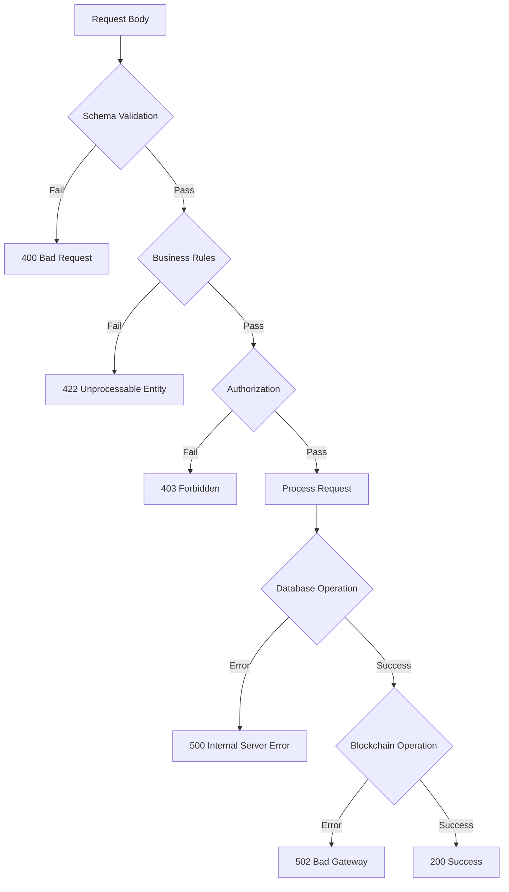

**Deliverables:**
- [ ] All CRUD endpoints implemented
- [ ] Request validation working
- [ ] Error handling comprehensive
- [ ] API documentation generated
- [ ] Postman collection created

---

#### **Days 13-14: Stellar Integration & Testing**

**Stellar Service Architecture:**

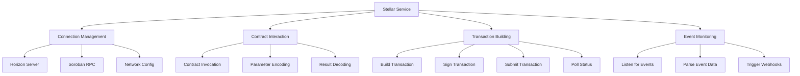

**Stellar Service Functions:**

1. **Contract Initialization**
   - Connect to Stellar network
   - Load contract by ID
   - Setup RPC client
   - Configure network passphrase

2. **Transaction Execution**
   - Build contract invocation
   - Simulate transaction
   - Prepare with fees
   - Sign with keypair
   - Submit to network
   - Poll for confirmation

3. **Data Retrieval**
   - Query contract state
   - Parse return values
   - Convert to application types
   - Cache results

4. **Event Monitoring**
   - Subscribe to contract events
   - Process event logs
   - Update database
   - Send notifications

**Testing Strategy:**

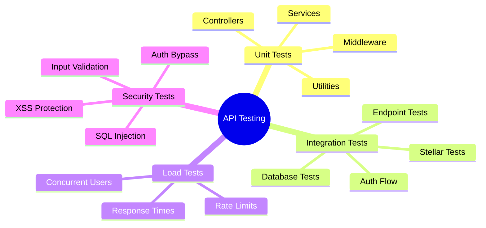

**Test Coverage Requirements:**

| Component | Coverage Target | Priority |
|-----------|----------------|----------|
| Controllers | 85% | High |
| Services | 90% | Critical |
| Middleware | 80% | High |
| Utilities | 75% | Medium |
| Routes | 95% | Critical |

**Week 2 Deliverables:**
✅ Complete REST API with all endpoints  
✅ PostgreSQL database with Prisma ORM  
✅ Stellar blockchain integration working  
✅ Authentication & authorization implemented  
✅ Comprehensive API tests (>80% coverage)  
✅ API documentation published  

---

## 🎨 Week 3: Frontend Development (Days 15-21)

### Overview
Build responsive React application with Tailwind CSS, wallet integration, and real-time updates.

### Weekly Goals
- ✅ Design UI/UX mockups
- ✅ Implement component library
- ✅ Build all pages and features
- ✅ Integrate Freighter wallet
- ✅ Connect to backend API

### Frontend Architecture

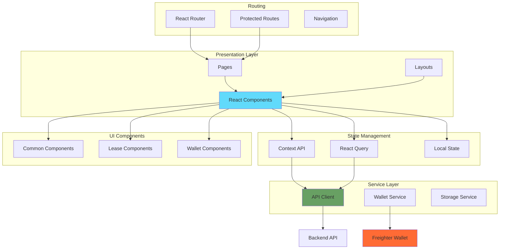

---

#### **Days 15-16: UI Design & Component Library**

**Component Hierarchy:**

```mermaid
graph TD
    A[App] --> B[ThemeProvider]
    B --> C[WalletProvider]
    C --> D[QueryProvider]
    D --> E[Router]
    
    E --> F[Layout]
    F --> G[Header]
    F --> H[Main Content]
    F --> I[Footer]
    
    G --> J[Logo]
    G --> K[Navigation]
    G --> L[WalletConnect]
    G --> M[ThemeToggle]
    
    H --> N[HomePage]
    H --> O[TenantDashboard]
    H --> P[LandlordDashboard]
    H --> Q[CreateLease]
    H --> R[LeaseDetails]
    H --> S[DisputePage]
    
    O --> T[LeaseList]
    T --> U[LeaseCard]
    U --> V[StatusBadge]
    U --> W[ActionButtons]
    
    R --> X[LeaseInfo]
    R --> Y[TransactionHistory]
    R --> Z[DisputeSection]
    R --> AA[ActionPanel]
```

**Directory Structure - Frontend:**

```
frontend/
├── public/
│   ├── favicon.ico
│   ├── logo.svg
│   └── manifest.json
│
├── src/
│   ├── assets/
│   │   ├── images/
│   │   │   ├── logo.svg
│   │   │   ├── hero-bg.jpg
│   │   │   └── illustrations/
│   │   └── icons/
│   │       └── (icon files)
│   │
│   ├── components/
│   │   ├── common/
│   │   │   ├── Button/
│   │   │   │   ├── Button.jsx
│   │   │   │   ├── Button.module.css
│   │   │   │   └── Button.test.jsx
│   │   │   ├── Card/
│   │   │   ├── Input/
│   │   │   ├── Modal/
│   │   │   ├── Spinner/
│   │   │   ├── Badge/
│   │   │   ├── Alert/
│   │   │   └── Skeleton/
│   │   │
│   │   ├── layout/
│   │   │   ├── Header/
│   │   │   │   ├── Header.jsx
│   │   │   │   ├── Navigation.jsx
│   │   │   │   └── MobileMenu.jsx
│   │   │   ├── Footer/
│   │   │   ├── Sidebar/
│   │   │   └── Layout.jsx
│   │   │
│   │   ├── lease/
│   │   │   ├── LeaseCard.jsx
│   │   │   ├── LeaseForm.jsx
│   │   │   ├── LeaseList.jsx
│   │   │   ├── LeaseTimeline.jsx
│   │   │   ├── LeaseFilters.jsx
│   │   │   └── LeaseStats.jsx
│   │   │
│   │   ├── wallet/
│   │   │   ├── WalletConnect.jsx
│   │   │   ├── WalletInfo.jsx
│   │   │   ├── TransactionModal.jsx
│   │   │   └── SignatureRequest.jsx
│   │   │
│   │   ├── dispute/
│   │   │   ├── DisputeForm.jsx
│   │   │   ├── DisputeCard.jsx
│   │   │   ├── EvidenceUpload.jsx
│   │   │   └── ResolutionPanel.jsx
│   │   │
│   │   └── transaction/
│   │       ├── TransactionList.jsx
│   │       ├── TransactionCard.jsx
│   │       └── TransactionStatus.jsx
│   │
│   ├── pages/
│   │   ├── Home/
│   │   │   ├── Home.jsx
│   │   │   ├── Hero.jsx
│   │   │   ├── Features.jsx
│   │   │   ├── HowItWorks.jsx
│   │   │   └── CallToAction.jsx
│   │   │
│   │   ├── TenantDashboard/
│   │   │   ├── TenantDashboard.jsx
│   │   │   ├── ActiveLeases.jsx
│   │   │   ├── PendingActions.jsx
│   │   │   └── Statistics.jsx
│   │   │
│   │   ├── LandlordDashboard/
│   │   │   ├── LandlordDashboard.jsx
│   │   │   ├── PropertyList.jsx
│   │   │   ├── RevenueStats.jsx
│   │   │   └── LeaseRequests.jsx
│   │   │
│   │   ├── CreateLease/
│   │   │   ├── CreateLease.jsx
│   │   │   ├── LeaseFormStep1.jsx
│   │   │   ├── LeaseFormStep2.jsx
│   │   │   └── LeaseFormStep3.jsx
│   │   │
│   │   ├── LeaseDetails/
│   │   │   ├── LeaseDetails.jsx
│   │   │   ├── Overview.jsx
│   │   │   ├── Timeline.jsx
│   │   │   ├── Documents.jsx
│   │   │   └── Actions.jsx
│   │   │
│   │   ├── DisputePage/
│   │   │   ├── DisputePage.jsx
│   │   │   ├── DisputeForm.jsx
│   │   │   └── DisputeHistory.jsx
│   │   │
│   │   └── NotFound/
│   │       └── NotFound.jsx
│   │
│   ├── context/
│   │   ├── ThemeContext.jsx       # Dark/light mode
│   │   ├── WalletContext.jsx      # Wallet connection
│   │   ├── AuthContext.jsx        # User authentication
│   │   └── NotificationContext.jsx # Toast notifications
│   │
│   ├── hooks/
│   │   ├── useWallet.js           # Wallet operations
│   │   ├── useLeases.js           # Lease data fetching
│   │   ├── useTheme.js            # Theme management
│   │   ├── useAuth.js             # Authentication
│   │   ├── useContract.js         # Contract interactions
│   │   └── useDebounce.js         # Utility hook
│   │
│   ├── services/
│   │   ├── api/
│   │   │   ├── client.js          # Axios instance
│   │   │   ├── lease.api.js       # Lease endpoints
│   │   │   ├── dispute.api.js     # Dispute endpoints
│   │   │   ├── transaction.api.js # Transaction endpoints
│   │   │   └── user.api.js        # User endpoints
│   │   │
│   │   ├── wallet/
│   │   │   ├── freighter.js       # Freighter integration
│   │   │   ├── stellar.js         # Stellar SDK
│   │   │   └── contract.js        # Contract calls
│   │   │
│   │   └── storage/
│   │       ├── localStorage.js    # Local storage
│   │       └── sessionStorage.js  # Session storage
│   │
│   ├── utils/
│   │   ├── constants.js           # App constants
│   │   ├── helpers.js             # Utility functions
│   │   ├── formatters.js          # Data formatting
│   │   ├── validators.js          # Form validation
│   │   └── dates.js               # Date utilities
│   │
│   ├── styles/
│   │   ├── index.css              # Global styles
│   │   ├── tailwind.css           # Tailwind imports
│   │   └── animations.css         # Custom animations
│   │
│   ├── App.jsx                    # Root component
│   ├── main.jsx                   # Entry point
│   └── routes.jsx                 # Route definitions
│
├── .env.example
├── .env.local
├── .env.development
├── .env.production
├── index.html
├── package.json
├── vite.config.js
├── tailwind.config.js
├── postcss.config.js
├── .eslintrc.js
├── .prettierrc
└── README.md
```

**Design System:**

```mermaid
mindmap
  root((Design System))
    Colors
      Primary Blue
      Secondary Gray
      Success Green
      Warning Yellow
      Danger Red
      Dark Mode Palette
    Typography
      Headings H1-H6
      Body Text
      Caption
      Code Font
    Spacing
      4px Base Unit
      8px 16px 24px 32px
      48px 64px
    Components
      Buttons
      Cards
      Inputs
      Modals
      Badges
    Breakpoints
      Mobile 320px
      Tablet 768px
      Desktop 1024px
      Wide 1440px
```

**Responsive Design Strategy:**

```mermaid
flowchart LR
    A[Mobile First] --> B[320px - 767px]
    B --> C[Single Column Layout]
    C --> D[Touch-Friendly UI]
    
    E[Tablet] --> F[768px - 1023px]
    F --> G[Two Column Layout]
    G --> H[Condensed Navigation]
    
    I[Desktop] --> J[1024px - 1439px]
    J --> K[Three Column Layout]
    K --> L[Full Navigation]
    
    M[Wide Screen] --> N[1440px+]
    N --> O[Max Width Container]
    O --> P[Optimal Reading Width]
```

**Deliverables:**
- [ ] UI/UX mockups completed
- [ ] Design system documented
- [ ] Common component library built
- [ ] Responsive layouts tested
- [ ] Accessibility guidelines followed

---

#### **Days 17-19: Page Development**

**User Flow Diagrams:**

**1. Tenant Journey:**

```mermaid
flowchart TD
    A[Landing Page] --> B{Has Wallet?}
    B -->|No| C[Install Freighter]
    B -->|Yes| D[Connect Wallet]
    C --> D
    D --> E[Tenant Dashboard]
    E --> F{Existing Lease?}
    F -->|No| G[Create Lease]
    F -->|Yes| H[View Lease Details]
    G --> I[Fill Lease Form]
    I --> J[Submit for Approval]
    J --> K[Wait for Landlord]
    K --> L[Pay Deposit]
    L --> M[Confirm Transaction]
    M --> N[Wait for Move-In Confirmation]
    N --> O[Lease Active]
    O --> P{Issues?}
    P -->|Yes| Q[Raise Dispute]
    P -->|No| R[Wait for Lease End]
    R --> S[Receive Deposit]
    S --> T[Lease Completed]
```

**2. Landlord Journey:**

```mermaid
flowchart TD
    A[Landing Page] --> B[Connect Wallet]
    B --> C[Landlord Dashboard]
    C --> D{New Lease Request?}
    D -->|Yes| E[Review Lease Terms]
    D -->|No| F[View Properties]
    E --> G{Accept Terms?}
    G -->|Yes| H[Wait for Deposit]
    G -->|No| I[Reject Lease]
    H --> J[Deposit Received]
    J --> K[Inspect Property]
    K --> L[Confirm Move-In]
    L --> M[Lease Active]
    M --> N[Monitor Lease]
    N --> O{Lease Ends?}
    O -->|Yes| P[Inspect Property]
    O -->|No| N
    P --> Q{Property OK?}
    Q -->|Yes| R[Release Deposit]
    Q -->|No| S[Raise Dispute]
    R --> T[Lease Completed]
```

**Page Components Breakdown:**

**Home Page:**
- Hero Section with CTA
- Features Grid (4 key features)
- How It Works (3 steps)
- Statistics Counter
- Testimonials Carousel
- FAQ Accordion
- Footer with Links

**Tenant Dashboard:**
- Wallet Connection Status
- Active Leases Summary
- Pending Actions Alert
- Lease Cards Grid
- Quick Stats (Total Deposited, Active Leases, Pending Returns)
- Filter & Search
- Create New Lease Button

**Landlord Dashboard:**
- Property Portfolio Overview
- Revenue Statistics
- Pending Lease Requests
- Active Leases List
- Lease Status Distribution Chart
- Recent Transactions
- Quick Actions Panel

**Create Lease Page:**
- Multi-Step Form
  - Step 1: Property Details
  - Step 2: Financial Terms
  - Step 3: Lease Duration
  - Step 4: Review & Submit
- Form Validation
- Progress Indicator
- Save Draft Functionality
- Preview Mode

**Lease Details Page:**
- Lease Information Card
- Status Timeline
- Transaction History
- Document Gallery
- Action Buttons (context-based)
- Dispute Section (if applicable)
- Communication Thread
- Export Options

**State Management:**

```mermaid
flowchart TB
    A[User Action] --> B[Component Event]
    B --> C{State Type?}
    
    C -->|Local| D[Component State]
    C -->|Shared| E[Context API]
    C -->|Server| F[React Query]
    
    D --> G[useState/useReducer]
    E --> H[useContext]
    F --> I[useQuery/useMutation]
    
    I --> J{Cache Hit?}
    J -->|Yes| K[Return Cached Data]
    J -->|No| L[Fetch from API]
    
    L --> M{Success?}
    M -->|Yes| N[Update Cache]
    M -->|No| O[Error State]
    
    N --> P[Render UI]
    O --> P
    K --> P
```

**Deliverables:**
- [ ] All pages implemented
- [ ] Navigation working
- [ ] Forms with validation
- [ ] Loading states
- [ ] Error handling
- [ ] Responsive on all devices

---

#### **Days 20-21: Wallet Integration & Polish**

**Wallet Integration Flow:**

```mermaid
sequenceDiagram
    participant User
    participant App
    participant Freighter
    participant Stellar
    participant Contract
    
    User->>App: Click "Connect Wallet"
    App->>Freighter: Request Connection
    Freighter->>User: Show Approval Dialog
    User->>Freighter: Approve
    Freighter->>App: Return Public Key
    App->>App: Save Wallet Address
    App->>User: Show Connected Status
    
    User->>App: Initiate Transaction
    App->>App: Build Transaction
    App->>Freighter: Request Signature
    Freighter->>User: Show Transaction Details
    User->>Freighter: Sign Transaction
    Freighter->>App: Return Signed XDR
    App->>Stellar: Submit Transaction
    Stellar->>Contract: Execute Function
    Contract->>Stellar: Return Result
    Stellar->>App: Transaction Hash
    App->>User: Show Success Message
```

**Transaction Handling:**

```mermaid
stateDiagram-v2
    [*] --> Idle
    Idle --> Building: User Action
    Building --> Signing: Transaction Ready
    Signing --> Submitting: Signature Received
    Signing --> Cancelled: User Cancels
    Submitting --> Pending: Transaction Sent
    Pending --> Confirming: In Ledger
    Pending --> Failed: Network Error
    Confirming --> Success: Confirmed
    Confirming --> Failed: Contract Error
    Success --> [*]
    Failed --> Idle: Retry Available
    Cancelled --> Idle
```

**UI Polish Checklist:**

```mermaid
mindmap
  root((UI Polish))
    Animations
      Page Transitions
      Button Hover Effects
      Card Entrance
      Loading Spinners
      Success Celebrations
    Accessibility
      Keyboard Navigation
      ARIA Labels
      Color Contrast
      Screen Reader Support
      Focus Indicators
    Performance
      Code Splitting
      Lazy Loading
      Image Optimization
      Bundle Size
      Lighthouse Score
    Error Handling
      Graceful Degradation
      User-Friendly Messages
      Retry Mechanisms
      Offline Support
    Final Touches
      Favicon
      Meta Tags
      Social Sharing
      PWA Support
```

**Performance Optimization:**

| Metric | Target | Strategy |
|--------|--------|----------|
| First Contentful Paint | < 1.5s | Code splitting, lazy loading |
| Time to Interactive | < 3s | Bundle optimization |
| Largest Contentful Paint | < 2.5s | Image optimization |
| Cumulative Layout Shift | < 0.1 | Reserved space for images |
| Total Bundle Size | < 200KB | Tree shaking, compression |

**Week 3 Deliverables:**
✅ Complete React application with all pages  
✅ Freighter wallet integration working  
✅ Responsive design on all devices  
✅ Dark mode fully functional  
✅ Smooth animations and transitions  
✅ Accessibility standards met  

---

## 🔗 Week 4: Integration & Deployment (Days 22-25)

### Overview
Connect all components, perform end-to-end testing, and deploy to production.

### Weekly Goals
- ✅ Full stack integration
- ✅ Comprehensive testing
- ✅ Performance optimization
- ✅ Production deployment
- ✅ Documentation completion

### Integration Architecture

```mermaid
graph TB
    subgraph "Production Environment"
        A[Vercel CDN]
        B[Railway Backend]
        C[PostgreSQL]
        D[Stellar Mainnet]
    end
    
    subgraph "Frontend"
        E[React App]
        F[Service Worker]
    end
    
    subgraph "Backend"
        G[API Server]
        H[Stellar Service]
    end
    
    subgraph "Monitoring"
        I[Error Tracking]
        J[Analytics]
        K[Performance Monitoring]
    end
    
    E --> A
    E --> F
    A --> G
    G --> B
    G --> C
    H --> D
    E --> I
    E --> J
    G --> K
    
    style A fill:#000000,color:#ffffff
    style B fill:#0B0D0E,color:#ffffff
    style D fill:#ff6b35
```

---

#### **Days 22-23: Integration & Testing**

**End-to-End Test Scenarios:**

```mermaid
flowchart TD
    A[E2E Test Suite] --> B[Happy Path Tests]
    A --> C[Error Handling Tests]
    A --> D[Edge Case Tests]
    
    B --> B1[Complete Lease Creation]
    B --> B2[Deposit Payment Flow]
    B --> B3[Lease Completion]
    B --> B4[Dispute Resolution]
    
    C --> C1[Network Failures]
    C --> C2[Wallet Errors]
    C --> C3[Invalid Inputs]
    C --> C4[Unauthorized Access]
    
    D --> D1[Concurrent Transactions]
    D --> D2[Large Data Sets]
    D --> D3[Expired Sessions]
    D --> D4[Browser Compatibility]
```

**Test Scenario 1: Complete Lease Lifecycle**

```mermaid
sequenceDiagram
    actor Tenant
    actor Landlord
    participant Frontend
    participant Backend
    participant Database
    participant Blockchain
    
    Note over Tenant,Blockchain: Lease Creation
    Tenant->>Frontend: Create Lease
    Frontend->>Backend: POST /api/leases
    Backend->>Database: INSERT lease
    Database-->>Backend: Lease ID
    Backend-->>Frontend: Success
    Frontend-->>Tenant: Lease Created
    
    Note over Tenant,Blockchain: Deposit Payment
    Tenant->>Frontend: Pay Deposit
    Frontend->>Tenant: Sign Transaction
    Tenant->>Blockchain: Submit Transaction
    Blockchain-->>Frontend: TX Hash
    Frontend->>Backend: Update Status
    Backend->>Database: UPDATE lease
    
    Note over Tenant,Blockchain: Move-In Confirmation
    Landlord->>Frontend: Confirm Move-In
    Frontend->>Blockchain: Execute Function
    Blockchain-->>Frontend: Confirmed
    Frontend->>Backend: Update Status
    
    Note over Tenant,Blockchain: Lease Completion
    Landlord->>Frontend: Release Deposit
    Frontend->>Blockchain: Execute Release
    Blockchain->>Tenant: Transfer Funds
    Frontend->>Backend: Update Status
    Backend->>Database: UPDATE lease
```

**Integration Test Matrix:**

| Test Case | Frontend | Backend | Database | Blockchain | Status |
|-----------|----------|---------|----------|------------|--------|
| User Registration | ✓ | ✓ | ✓ | - | Pass |
| Wallet Connection | ✓ | - | - | ✓ | Pass |
| Create Lease | ✓ | ✓ | ✓ | - | Pass |
| Initialize Contract | ✓ | ✓ | ✓ | ✓ | Pass |
| Pay Deposit | ✓ | ✓ | ✓ | ✓ | Pass |
| Confirm Move-In | ✓ | ✓ | ✓ | ✓ | Pass |
| Raise Dispute | ✓ | ✓ | ✓ | ✓ | Pass |
| Resolve Dispute | ✓ | ✓ | ✓ | ✓ | Pass |
| Release Deposit | ✓ | ✓ | ✓ | ✓ | Pass |
| View Transactions | ✓ | ✓ | ✓ | ✓ | Pass |

**Performance Testing:**

```mermaid
graph LR
    A[Load Testing] --> B[Apache JMeter]
    A --> C[Artillery]
    
    B --> D[API Endpoints]
    C --> D
    
    D --> E[Measure Response Times]
    D --> F[Measure Throughput]
    D --> G[Identify Bottlenecks]
    
    E --> H[Optimization]
    F --> H
    G --> H
    
    H --> I[Database Indexing]
    H --> J[Caching Layer]
    H --> K[Query Optimization]
```

**Security Testing:**

```mermaid
mindmap
  root((Security))
    Authentication
      JWT Validation
      Session Management
      Token Expiry
    Authorization
      Role-Based Access
      Resource Ownership
      API Permissions
    Input Validation
      SQL Injection
      XSS Prevention
      CSRF Protection
    Data Protection
      Encryption at Rest
      HTTPS Only
      Secret Management
    Smart Contract
      Access Control
      Reentrancy Guard
      Integer Overflow
```

**Deliverables:**
- [ ] All integration tests passing
- [ ] E2E tests covering critical paths
- [ ] Performance benchmarks met
- [ ] Security audit completed
- [ ] Bug fixes implemented

---

#### **Days 24-25: Deployment & Documentation**

**Deployment Pipeline:**

```mermaid
flowchart TD
    A[Git Push] --> B[GitHub Actions]
    B --> C{Branch?}
    
    C -->|main| D[Production Deploy]
    C -->|develop| E[Staging Deploy]
    C -->|feature/*| F[Preview Deploy]
    
    D --> G[Run Tests]
    E --> G
    F --> G
    
    G --> H{Tests Pass?}
    H -->|No| I[Notify Failure]
    H -->|Yes| J[Build Frontend]
    
    I --> K[Rollback]
    J --> L[Build Backend]
    
    L --> M[Deploy to Vercel]
    M --> N[Deploy to Railway]
    N --> O[Run Migrations]
    O --> P[Health Check]
    
    P --> Q{Healthy?}
    Q -->|Yes| R[Deploy Success]
    Q -->|No| K
    
    R --> S[Notify Team]
```

**Infrastructure as Code:**

```mermaid
graph TB
    subgraph "Version Control"
        A[GitHub Repository]
    end
    
    subgraph "CI/CD"
        B[GitHub Actions]
        C[Build Pipeline]
        D[Test Pipeline]
        E[Deploy Pipeline]
    end
    
    subgraph "Hosting"
        F[Vercel - Frontend]
        G[Railway - Backend]
        H[Railway - Database]
    end
    
    subgraph "Monitoring"
        I[Sentry - Error Tracking]
        J[Vercel Analytics]
        K[Railway Metrics]
    end
    
    A --> B
    B --> C
    C --> D
    D --> E
    E --> F
    E --> G
    E --> H
    F --> I
    F --> J
    G --> K
```

**Deployment Environments:**

```mermaid
graph LR
    A[Local] --> B[Development]
    B --> C[Staging]
    C --> D[Production]
    
    A --> A1[localhost:3000]
    A --> A2[localhost:5000]
    
    B --> B1[dev.rentalvault.app]
    B --> B2[api-dev.rentalvault.app]
    
    C --> C1[staging.rentalvault.app]
    C --> C2[api-staging.rentalvault.app]
    
    D --> D1[rentalvault.app]
    D --> D2[api.rentalvault.app]
```

**Deployment Checklist:**

**Pre-Deployment:**
- [ ] All tests passing (100%)
- [ ] Code review completed
- [ ] Security scan passed
- [ ] Environment variables configured
- [ ] Database migrations prepared
- [ ] Backup strategy in place
- [ ] Rollback plan documented
- [ ] Performance baseline established

**Smart Contract:**
- [ ] Final audit completed
- [ ] Gas optimization done
- [ ] Mainnet deployment script ready
- [ ] Contract verified on explorer
- [ ] Emergency pause mechanism tested

**Backend:**
- [ ] Production database created
- [ ] Environment variables set
- [ ] SSL certificates configured
- [ ] Rate limiting configured
- [ ] Logging set up
- [ ] Health check endpoint active
- [ ] API documentation published

**Frontend:**
- [ ] Production build optimized
- [ ] Environment variables set
- [ ] CDN configured
- [ ] Service worker registered
- [ ] PWA manifest configured
- [ ] Analytics integrated
- [ ] Error tracking enabled

**Post-Deployment:**
- [ ] Smoke tests passed
- [ ] Monitoring alerts configured
- [ ] Documentation updated
- [ ] Team notified
- [ ] Changelog published
- [ ] User communication sent

**Documentation Structure:**

```
docs/
├── README.md                   # Project overview
├── ARCHITECTURE.md             # System architecture
├── API_REFERENCE.md            # API documentation
├── SMART_CONTRACT.md           # Contract documentation
├── USER_GUIDE.md               # End-user manual
├── DEVELOPER_GUIDE.md          # Development setup
├── DEPLOYMENT.md               # Deployment guide
├── TESTING.md                  # Testing strategies
├── SECURITY.md                 # Security best practices
├── CONTRIBUTING.md             # Contribution guidelines
└── CHANGELOG.md                # Version history
```

**Monitoring Dashboard:**

```mermaid
graph TB
    A[Monitoring Dashboard] --> B[Application Metrics]
    A --> C[Infrastructure Metrics]
    A --> D[Business Metrics]
    
    B --> B1[Response Times]
    B --> B2[Error Rates]
    B --> B3[Request Volume]
    
    C --> C1[CPU Usage]
    C --> C2[Memory Usage]
    C --> C3[Database Connections]
    
    D --> D1[Active Leases]
    D --> D2[Total Deposits]
    D --> D3[User Growth]
```

**Week 4 Deliverables:**
✅ Full application deployed to production  
✅ All systems integrated and tested  
✅ Monitoring and alerts configured  
✅ Complete documentation published  
✅ User guides and tutorials ready  
✅ Post-launch support plan in place  

---

## 📁 Complete File Structure

### Comprehensive Project Tree

```
rental-vault/
│
├── 📄 README.md
├── 📄 LICENSE
├── 📄 .gitignore
├── 📄 .env.example
├── 📄 docker-compose.yml
├── 📄 Cargo.toml (Workspace)
│
├── 📁 contracts/
│   └── 📁 lease-vault/
│       ├── 📁 src/
│       │   ├── lib.rs              # Main contract logic
│       │   ├── types.rs            # Data structures
│       │   ├── storage.rs          # Storage management
│       │   ├── validation.rs       # Input validation
│       │   └── test.rs             # Test suite
│       ├── Cargo.toml              # Contract dependencies
│       ├── Cargo.lock
│       └── README.md
│
├── 📁 backend/
│   ├── 📁 src/
│   │   ├── 📁 config/
│   │   │   ├── database.js
│   │   │   ├── stellar.js
│   │   │   ├── email.js
│   │   │   └── storage.js
│   │   │
│   │   ├── 📁 controllers/
│   │   │   ├── auth.controller.js
│   │   │   ├── lease.controller.js
│   │   │   ├── dispute.controller.js
│   │   │   ├── transaction.controller.js
│   │   │   ├── user.controller.js
│   │   │   └── document.controller.js
│   │   │
│   │   ├── 📁 middleware/
│   │   │   ├── auth.middleware.js
│   │   │   ├── validation.middleware.js
│   │   │   ├── error.middleware.js
│   │   │   ├── ratelimit.middleware.js
│   │   │   └── upload.middleware.js
│   │   │
│   │   ├── 📁 routes/
│   │   │   ├── auth.routes.js
│   │   │   ├── lease.routes.js
│   │   │   ├── dispute.routes.js
│   │   │   ├── transaction.routes.js
│   │   │   ├── user.routes.js
│   │   │   └── document.routes.js
│   │   │
│   │   ├── 📁 services/
│   │   │   ├── stellar.service.js
│   │   │   ├── lease.service.js
│   │   │   ├── user.service.js
│   │   │   ├── email.service.js
│   │   │   └── storage.service.js
│   │   │
│   │   ├── 📁 utils/
│   │   │   ├── logger.js
│   │   │   ├── validators.js
│   │   │   ├── helpers.js
│   │   │   ├── constants.js
│   │   │   └── errors.js
│   │   │
│   │   └── server.js
│   │
│   ├── 📁 prisma/
│   │   ├── schema.prisma
│   │   ├── 📁 migrations/
│   │   └── seed.js
│   │
│   ├── 📁 tests/
│   │   ├── 📁 unit/
│   │   ├── 📁 integration/
│   │   └── setup.js
│   │
│   ├── 📁 logs/
│   ├── .env.example
│   ├── .env.development
│   ├── .env.production
│   ├── package.json
│   ├── package-lock.json
│   ├── jest.config.js
│   ├── Dockerfile
│   └── README.md
│
├── 📁 frontend/
│   ├── 📁 public/
│   │   ├── favicon.ico
│   │   ├── logo.svg
│   │   └── manifest.json
│   │
│   ├── 📁 src/
│   │   ├── 📁 assets/
│   │   │   ├── 📁 images/
│   │   │   └── 📁 icons/
│   │   │
│   │   ├── 📁 components/
│   │   │   ├── 📁 common/
│   │   │   │   ├── 📁 Button/
│   │   │   │   ├── 📁 Card/
│   │   │   │   ├── 📁 Input/
│   │   │   │   ├── 📁 Modal/
│   │   │   │   └── 📁 Spinner/
│   │   │   │
│   │   │   ├── 📁 layout/
│   │   │   │   ├── 📁 Header/
│   │   │   │   ├── 📁 Footer/
│   │   │   │   └── Layout.jsx
│   │   │   │
│   │   │   ├── 📁 lease/
│   │   │   │   ├── LeaseCard.jsx
│   │   │   │   ├── LeaseForm.jsx
│   │   │   │   ├── LeaseList.jsx
│   │   │   │   └── LeaseTimeline.jsx
│   │   │   │
│   │   │   ├── 📁 wallet/
│   │   │   │   ├── WalletConnect.jsx
│   │   │   │   ├── WalletInfo.jsx
│   │   │   │   └── TransactionModal.jsx
│   │   │   │
│   │   │   ├── 📁 dispute/
│   │   │   └── 📁 transaction/
│   │   │
│   │   ├── 📁 pages/
│   │   │   ├── 📁 Home/
│   │   │   ├── 📁 TenantDashboard/
│   │   │   ├── 📁 LandlordDashboard/
│   │   │   ├── 📁 CreateLease/
│   │   │   ├── 📁 LeaseDetails/
│   │   │   ├── 📁 DisputePage/
│   │   │   └── 📁 NotFound/
│   │   │
│   │   ├── 📁 context/
│   │   │   ├── ThemeContext.jsx
│   │   │   ├── WalletContext.jsx
│   │   │   ├── AuthContext.jsx
│   │   │   └── NotificationContext.jsx
│   │   │
│   │   ├── 📁 hooks/
│   │   │   ├── useWallet.js
│   │   │   ├── useLeases.js
│   │   │   ├── useTheme.js
│   │   │   └── useAuth.js
│   │   │
│   │   ├── 📁 services/
│   │   │   ├── 📁 api/
│   │   │   ├── 📁 wallet/
│   │   │   └── 📁 storage/
│   │   │
│   │   ├── 📁 utils/
│   │   │   ├── constants.js
│   │   │   ├── helpers.js
│   │   │   ├── formatters.js
│   │   │   └── validators.js
│   │   │
│   │   ├── 📁 styles/
│   │   │   ├── index.css
│   │   │   ├── tailwind.css
│   │   │   └── animations.css
│   │   │
│   │   ├── App.jsx
│   │   ├── main.jsx
│   │   └── routes.jsx
│   │
│   ├── .env.example
│   ├── .env.local
│   ├── index.html
│   ├── package.json
│   ├── package-lock.json
│   ├── vite.config.js
│   ├── tailwind.config.js
│   ├── postcss.config.js
│   ├── .eslintrc.js
│   ├── .prettierrc
│   ├── Dockerfile
│   ├── nginx.conf
│   └── README.md
│
├── 📁 scripts/
│   ├── setup-env.sh              # Environment setup
│   ├── deploy-contract.sh         # Contract deployment
│   ├── deploy-backend.sh          # Backend deployment
│   ├── deploy-frontend.sh         # Frontend deployment
│   ├── test-integration.sh        # Integration tests
│   ├── backup-database.sh         # Database backup
│   └── monitor-health.sh          # Health monitoring
│
├── 📁 docs/
│   ├── README.md
│   ├── ARCHITECTURE.md
│   ├── API_REFERENCE.md
│   ├── SMART_CONTRACT.md
│   ├── USER_GUIDE.md
│   ├── DEVELOPER_GUIDE.md
│   ├── DEPLOYMENT.md
│   ├── TESTING.md
│   ├── SECURITY.md
│   ├── CONTRIBUTING.md
│   └── CHANGELOG.md
│
├── 📁 .github/
│   ├── 📁 workflows/
│   │   ├── ci.yml
│   │   ├── deploy.yml
│   │   └── test.yml
│   ├── ISSUE_TEMPLATE.md
│   └── PULL_REQUEST_TEMPLATE.md
│
└── 📁 infrastructure/
    ├── docker-compose.yml
    ├── docker-compose.prod.yml
    ├── nginx.conf
    └── monitoring/
        ├── prometheus.yml
        └── grafana-dashboard.json
```

---

## 🧪 Testing Strategy

### Testing Pyramid

```mermaid
graph TD
    A[E2E Tests] --> B[10%]
    C[Integration Tests] --> D[30%]
    E[Unit Tests] --> F[60%]
    
    style A fill:#ff6b6b
    style C fill:#ffd93d
    style E fill:#6bcf7f
```

### Test Coverage by Layer

```mermaid
pie title Test Distribution
    "Unit Tests" : 60
    "Integration Tests" : 30
    "E2E Tests" : 10
```

### Testing Tools & Frameworks

| Layer | Tool | Purpose |
|-------|------|---------|
| Smart Contract | Cargo Test | Rust unit tests |
| Backend API | Jest + Supertest | API endpoint testing |
| Frontend | Jest + React Testing Library | Component testing |
| E2E | Playwright/Cypress | User flow testing |
| Performance | Artillery | Load testing |
| Security | OWASP ZAP | Security scanning |

### Test Scenarios

**Critical Path Tests:**
1. Complete lease creation and payment flow
2. Deposit release after lease end
3. Dispute raise and resolution
4. Wallet connection and transaction signing
5. Multi-user concurrent operations

**Edge Case Tests:**
1. Transaction failures and retries
2. Network disconnections
3. Invalid input handling
4. Expired sessions
5. Race conditions

**Security Tests:**
1. SQL injection attempts
2. XSS vulnerability checks
3. CSRF token validation
4. Authorization bypass attempts
5. Rate limiting effectiveness

---

## 🚀 Deployment Architecture

### Multi-Environment Strategy

```mermaid
graph TB
    subgraph "Development"
        A1[Local Machine]
        A2[Docker Compose]
        A3[Testnet]
    end
    
    subgraph "Staging"
        B1[Staging Frontend]
        B2[Staging API]
        B3[Staging DB]
        B4[Testnet]
    end
    
    subgraph "Production"
        C1[Production Frontend]
        C2[Production API]
        C3[Production DB]
        C4[Mainnet]
    end
    
    A1 --> B1
    A2 --> B2
    A3 --> B4
    
    B1 --> C1
    B2 --> C2
    B3 --> C3
    B4 --> C4
```

### Infrastructure Components

```mermaid
graph LR
    A[Users] --> B[Cloudflare CDN]
    B --> C[Vercel Frontend]
    B --> D[Railway Backend]
    D --> E[PostgreSQL]
    D --> F[Redis Cache]
    D --> G[Stellar Network]
    
    H[Monitoring] --> I[Sentry]
    H --> J[Datadog]
    H --> K[Grafana]
    
    C --> H
    D --> H
```

### Deployment Platforms

**Frontend Options:**
1. **Vercel** (Recommended)
   - Automatic deployments from Git
   - Edge network for global performance
   - Preview deployments for PRs
   - Built-in analytics

2. **Netlify**
   - Similar to Vercel
   - Form handling
   - Function support

3. **AWS Amplify**
   - Full AWS integration
   - Custom domain management

**Backend Options:**
1. **Railway** (Recommended)
   - Easy deployment
   - Database included
   - Auto-scaling
   - Free tier available

2. **Render**
   - Similar to Railway
   - Auto-deploys from Git
   - Database backups

3. **DigitalOcean App Platform**
   - Managed Kubernetes
   - Database clusters
   - Load balancing

**Database Options:**
1. **Railway PostgreSQL** (Recommended)
   - Integrated with backend
   - Automatic backups
   - Connection pooling

2. **Supabase**
   - PostgreSQL with extras
   - Real-time subscriptions
   - Built-in auth

3. **Neon**
   - Serverless PostgreSQL
   - Branching database
   - Auto-scaling

---

## 📊 Performance & Scalability

### Performance Targets

```mermaid
graph LR
    A[Performance Metrics] --> B[Response Time < 100ms]
    A --> C[Page Load < 2s]
    A --> D[Transaction Confirmation < 5s]
    A --> E[API Throughput > 1000 req/s]
    A --> F[Uptime > 99.9%]
```

### Scalability Strategy

```mermaid
flowchart TD
    A[Load Increase] --> B{Bottleneck?}
    B -->|Frontend| C[CDN Caching]
    B -->|Backend| D[Horizontal Scaling]
    B -->|Database| E[Read Replicas]
    B -->|Contract| F[Batch Operations]
    
    C --> G[Monitor Performance]
    D --> G
    E --> G
    F --> G
    
    G --> H{Target Met?}
    H -->|No| A
    H -->|Yes| I[Stable State]
```

### Optimization Techniques

**Frontend:**
- Code splitting and lazy loading
- Image optimization and WebP format
- Service worker caching
- Bundle size optimization
- Tree shaking unused code

**Backend:**
- Database query optimization
- Connection pooling
- Redis caching layer
- API response compression
- Rate limiting

**Smart Contract:**
- Gas optimization
- Batch operations where possible
- Efficient storage patterns
- Minimal on-chain data

---

## 📈 Monitoring & Analytics

### Monitoring Stack

```mermaid
graph TB
    A[Application] --> B[Metrics Collection]
    B --> C[Sentry - Error Tracking]
    B --> D[DataDog - APM]
    B --> E[Grafana - Visualization]
    B --> F[AlertManager]
    
    C --> G[Dashboard]
    D --> G
    E --> G
    
    F --> H[Slack Notifications]
    F --> I[Email Alerts]
    F --> J[PagerDuty]
```

### Key Metrics to Track

**Application Metrics:**
- Request rate
- Error rate
- Response time
- Active users
- Transaction success rate

**Business Metrics:**
- Total leases created
- Total value locked
- Average lease duration
- Dispute rate
- User retention

**Infrastructure Metrics:**
- CPU usage
- Memory usage
- Database connections
- API latency
- Blockchain transaction fees

---

## 🔒 Security Considerations

### Security Layers

```mermaid
mindmap
  root((Security))
    Smart Contract
      Access Control
      Reentrancy Guard
      Integer Overflow Protection
      Emergency Pause
    Backend API
      JWT Authentication
      Rate Limiting
      Input Validation
      SQL Injection Prevention
    Frontend
      XSS Prevention
      CSRF Protection
      Content Security Policy
      Secure Storage
    Infrastructure
      HTTPS Only
      DDoS Protection
      Firewall Rules
      Regular Backups
```

### Security Checklist

**Development:**
- [ ] Secrets in environment variables
- [ ] No hardcoded credentials
- [ ] Dependency vulnerability scanning
- [ ] Code review process
- [ ] Security testing in CI/CD

**Production:**
- [ ] SSL/TLS certificates
- [ ] Firewall configured
- [ ] DDoS protection enabled
- [ ] Backup strategy in place
- [ ] Incident response plan

**Monitoring:**
- [ ] Failed login attempts tracked
- [ ] Suspicious activity alerts
- [ ] Regular security audits
- [ ] Penetration testing scheduled
- [ ] Compliance checks

---

## 📚 Additional Resources

### Learning Materials

**Stellar Development:**
- [Stellar Documentation](https://developers.stellar.org/)
- [Soroban Docs](https://soroban.stellar.org/)
- [Stellar Quest](https://quest.stellar.org/)

**React & Frontend:**
- [React Documentation](https://react.dev/)
- [Tailwind CSS](https://tailwindcss.com/)
- [Vite Guide](https://vitejs.dev/guide/)

**Backend Development:**
- [Express.js](https://expressjs.com/)
- [Prisma Docs](https://www.prisma.io/docs/)
- [Node.js Best Practices](https://github.com/goldbergyoni/nodebestpractices)

### Community & Support

- GitHub Discussions
- Discord Community
- Stack Overflow
- Stellar Developer Discord

---

## 🎉 Conclusion

This 25-day roadmap provides a comprehensive guide to building Rental Vault from the ground up. By following this structured approach, you'll create a production-ready decentralized application that leverages the power of Stellar blockchain.

### Success Metrics

✅ Smart contract deployed and tested on Stellar testnet  
✅ RESTful API serving all required endpoints  
✅ Responsive React frontend with wallet integration  
✅ Complete test coverage across all layers  
✅ Production deployment on reliable hosting  
✅ Comprehensive documentation for users and developers  

### Next Steps

1. Set up your development environment (Day 1)
2. Follow the daily tasks meticulously
3. Test thoroughly at each stage
4. Deploy to testnet first, then mainnet
5. Gather user feedback and iterate
6. Plan for future enhancements

### Remember

- **Test early, test often**
- **Document as you build**
- **Security is not optional**
- **User experience matters**
- **Community feedback is valuable**

---

**Ready to build the future of rental agreements? Let's get started! 🚀**

---

*Built with passion for decentralization | Powered by Stellar*  
*Version 1.0.0 | Last Updated: November 2, 2025*